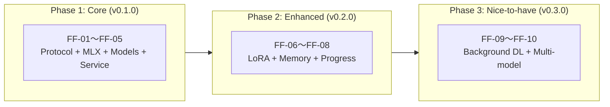
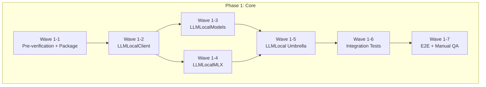
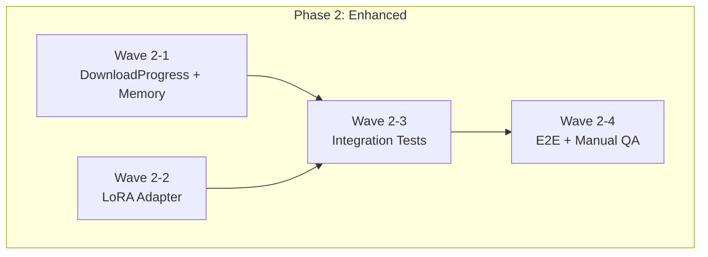
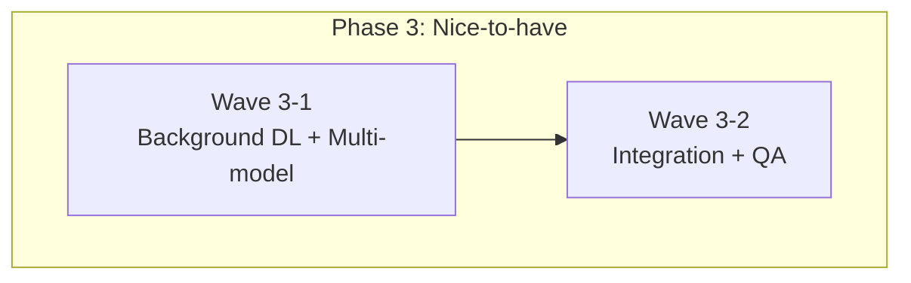
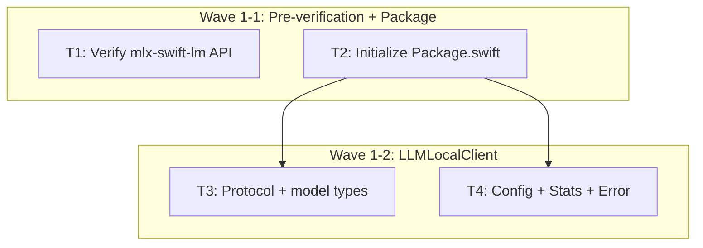
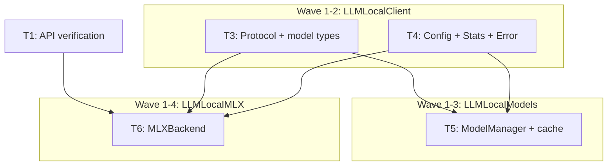
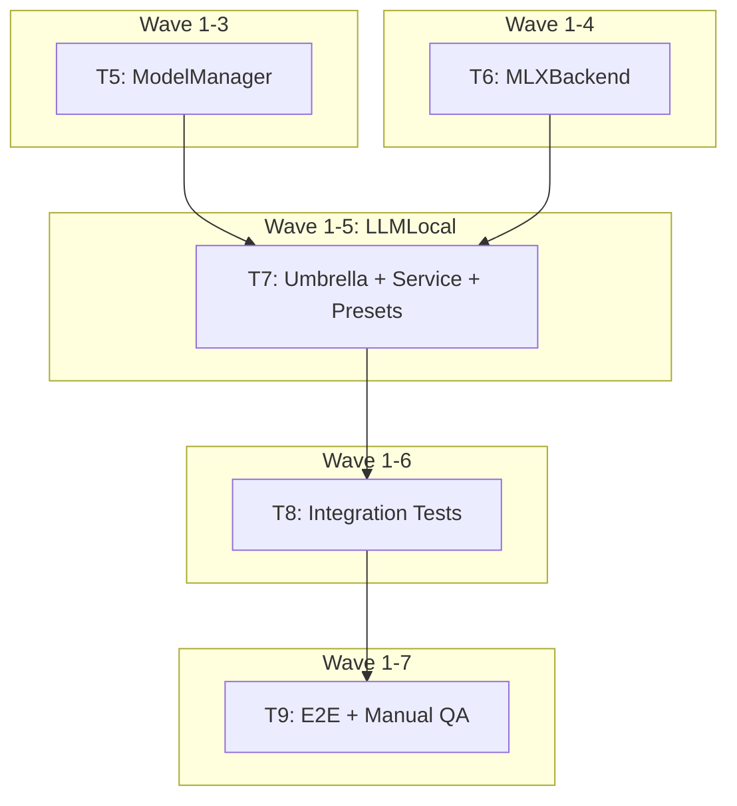
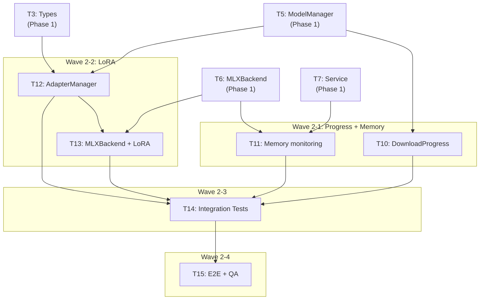
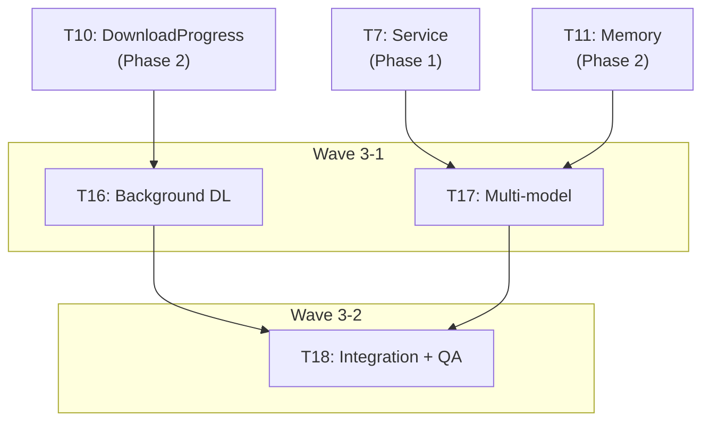
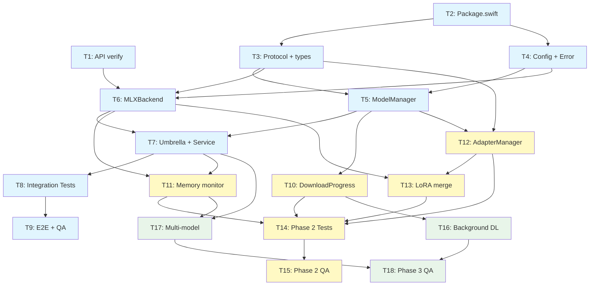

# Task Dependency Graph

## Phase 間依存関係図

## Wave 間依存関係図

### Phase 1

### Phase 2

### Phase 3

## Task 間依存関係図

### Phase 1: Wave 1-1 → Wave 1-2

### Phase 1: Wave 1-2 → Wave 1-3/1-4

### Phase 1: Wave 1-3/1-4 → Wave 1-5 → Wave 1-6 → Wave 1-7

### Phase 2: 全タスク依存関係

### Phase 3: 全タスク依存関係

## 全体俯瞰図

凡例:
- 青: Phase 1（Core）
- 黄: Phase 2（Enhanced）
- 緑: Phase 3（Nice-to-have）
